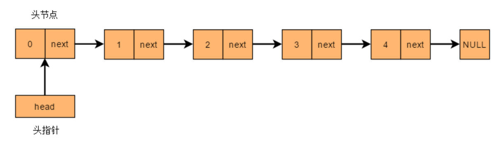

# 数据结构与算法

<button onclick="toggleNightMode()">切换黑夜模式</button>

<style>
body.night-mode {
    background-color: #282c34; /* 设置黑夜模式背景色 */
    color: #ffffff; /* 设置黑夜模式字体颜色 */
    transition: background-color 0.5s ease; /* 设置黑夜模式切换动画 */
    pre {
    background-color: #000000 !important; /* 设置黑夜模式背景色 */
    color: #ffffff !important; /* 设置黑夜模式字体颜色 */
    padding: 10px; /* 添加内边距，提高可读性 */
    border-radius: 5px; /* 可选：设置圆角效果 */
    overflow-x: auto; /* 允许水平滚动 */
    }
    code {
        background-color: inherit; /* 继承父元素背景色 */
        color: inherit; /* 继承父元素字体颜色 */
        padding: 0; /* 去除内边距 */
        border-radius: 0; /* 去除圆角 */
    }
}
</style>  

<script>
function toggleNightMode() {
  var body = document.body;
  body.classList.toggle("night-mode");
}
</script>   


## 目录
* [链表](#链表)

## 链表

[1.单链表](#单链表)
[2.循环链表](#循环链表)
[3.双向链表](#双向链表)   

***

* 主要写一下链表的创建，删除，遍历，查改
* 一些常见bug在最后面

***

### 单链表   

[1.创建链表](#1创建链表)
[2.表的遍历](#2表的遍历)
[3.删除](#3删除)
[4.插入](#4插入)
[5.修改](#5反转链表)
[6.完整代码与演示](#完整代码与演示)



#### 1.创建链表
```c
//链表结构体
typedef struct List{
    int data;//存放的数据
    struct List* next;//下一个节点
}List;

//创建头节点
int main(){
    List *head = (List*)malloc(sizeof(List));
    head = NULL;
    return 0;
}
```   

#### 2.表的遍历
```c
List* p = *head;
while(判断条件) {
    ...
    p = p->next;//当前节点替换为下一个节点
}
```
常见条件：
> 1.p->next != NULL     链表到最末端   

> 2.p != head           不包含头指针   

#### 3.删除
```c
void delete(List** head, int pos){
    List* p = *head;
    int q = pos;

    while (p != NULL && p->next != NULL && --pos) p = p->next;//找到指定元素的上一个节点

    if (pos || p->next == NULL) {
        printf("没有第%d位元素\n", q);
        return;
    }

    p->next = p->next->next;
}
```     

#### 4.插入
```c
//始终将下一个元素放到head后面，后面的元素不动
void first_insert(List** head, int data) {//头插法
    List* new_node = (List*)malloc(sizeof(List));
    List* node = (*head)->next;
    (*head)->next = new_node;
    new_node->next = node;
    new_node->data = data;
}
//始终把下一个元素放到链表末端
void finally_insert(List** head, int data) {//尾插法
    List* new_node = (List*)malloc(sizeof(List));
    List* p = *head;
    while (p->next != NULL) p = p->next;
    p->next = new_node;
    new_node->next = NULL;
    new_node->data = data;
}
```   
     
#### 5.反转链表   
```c
//无头节点的链表反转
List* reverse(List* head) {
    List* p = head;
    if (p == NULL || p->next == NULL) return head;

    List* ptr = reverse(p->next);
    p->next->next = p;
    p->next = NULL;
    return ptr;
}

//有头节点的链表反转
List* head_reverse(List* p) {
    p->next = reverse(p->next);
    return p;
}
```

**<u><font color = red>易错提醒:</font></u>**   

> 1. 传参使用**head，而不是*head，因为*head无法修改一级指针的值，所以要传二级指针   

> 2. 头指针要用另一指针代替，是为了避免头指针丢失，不能为了偷懒直接用头指针迭代

#### 完整代码与演示
```c
#include <stdio.h>
#include <stdlib.h>
#include <malloc.h>

typedef struct List{
    int data;
    struct List* next;
}List;

void first_insert(List** head, int data) {//头插法
    List* new_node = (List*)malloc(sizeof(List));
    List* node = (*head)->next;
    (*head)->next = new_node;
    new_node->next = node;
    new_node->data = data;
}

void finally_insert(List** head, int data) {//尾插法
    List* new_node = (List*)malloc(sizeof(List));
    List* p = *head;

    while (p->next != NULL) p = p->next;

    p->next = new_node;
    new_node->next = NULL;
    new_node->data = data;
}

void show(List** head) {
    List* p = (*head)->next;
    while (p != NULL) {
        printf("%d ", p->data);
        p = p->next;
    }
    puts("");
}

void delete(List** head, int pos) {//删除第pos位元素
    List* p = *head;
    int q = pos;

    while (p != NULL && p->next != NULL && --pos) p = p->next;

    if (pos || p->next == NULL) {
        printf("没有第%d位元素\n", q);
        return;
    }

    p->next = p->next->next;
}

void modifly(List** head, int data, int pos) {
    List* p = (*head)->next;
    int q = pos;

    while (p != NULL && p->next != NULL && --pos) p = p->next;

    if (pos || p->next == NULL) {
        printf("没有第%d位元素\n", q);
        return;
    }

    p->data = data;
}

int main() {
    List* head = (List*)malloc(sizeof(List));
    head->next = NULL;
    for (int i = 1; i <= 5; i++) {
        finally_insert(&head, i);
        show(&head);
    }
    puts("删除第二个元素:");
    delete(&head, 2);
    show(&head);
    puts("修改第三个元素:");
    modifly(&head, 0, 3);
    show(&head);
    return 0;
}

/*
1
1 2
1 2 3
1 2 3 4
1 2 3 4 5
删除第二个元素:
1 3 4 5
修改第三个元素:
1 3 0 5
*/
```

### 进阶：循环链表
<u>***就是把尾结点的next指针指向头结点，这样就成了环形链表***</u>

```c
void create_circle(List** head) {
    List* p = *head;
    while (p->next != NULL) p = p->next;
    p->next = *head;
}
```

### 双向链表
<u>***就是把每个结点都有两个指针，一个指向前驱结点，一个指向后继结点***</u>   
