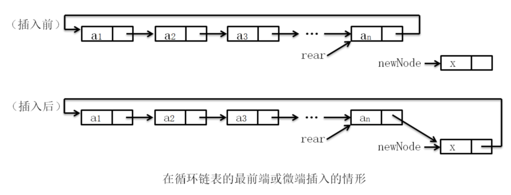
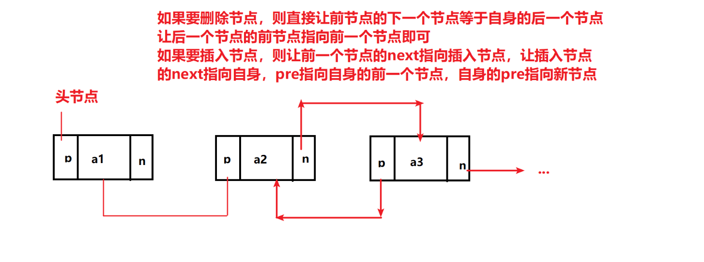

# 数据结构与算法

<button onclick="toggleNightMode()">切换黑夜模式</button>

<style>
body.night-mode {
    background-color: #282c34; /* 设置黑夜模式背景色 */
    color: #ffffff; /* 设置黑夜模式字体颜色 */
    transition: background-color 0.5s ease; /* 设置黑夜模式切换动画 */
    pre {
    background-color: #000000 !important; /* 设置黑夜模式背景色 */
    color: #ffffff !important; /* 设置黑夜模式字体颜色 */
    padding: 10px; /* 添加内边距，提高可读性 */
    border-radius: 5px; /* 可选：设置圆角效果 */
    overflow-x: auto; /* 允许水平滚动 */
    }
    code {
        background-color: inherit; /* 继承父元素背景色 */
        color: inherit; /* 继承父元素字体颜色 */
        padding: 0; /* 去除内边距 */
        border-radius: 0; /* 去除圆角 */
    }
}
</style>  

<link rel="stylesheet" href="https://cdnjs.cloudflare.com/ajax/libs/highlight.js/11.8.0/styles/default.min.css">
<script src="https://cdnjs.cloudflare.com/ajax/libs/highlight.js/11.8.0/highlight.min.js"></script>
<script>
  hljs.highlightAll();
</script>

<script>
function toggleNightMode() {
  var body = document.body;
  body.classList.toggle("night-mode");
}
</script>   


## 目录
* [链表](#链表)

## 链表

[1.单链表](#单链表)   
[2.循环链表](#循环链表)   
[3.双向链表](#双向链表)    

***

* 主要写一下链表的创建，删除，遍历，查改
* 一些常见bug在最后面

***

### 单链表   

[1.创建链表](#1创建链表)   
[2.表的遍历](#2表的遍历)   
[3.删除](#3删除)   
[4.插入](#4插入)   
[5.修改](#5反转链表)   
[6.完整代码与演示](#完整代码与演示)   


#### 1.创建链表
```c
//链表结构体
typedef struct List{
    int data;//存放的数据
    struct List* next;//下一个节点
}List;

//创建头节点
int main(){
    List *head = (List*)malloc(sizeof(List));
    head = NULL;
    return 0;
}
```   

#### 2.表的遍历
```c
List* p = *head;
while(判断条件) {
    ...
    p = p->next;//当前节点替换为下一个节点
}
```
常见条件：
> 1.p->next != NULL     链表到最末端   

> 2.p != head           不包含头指针   

#### 3.删除
```c
void delete(List** head, int pos){
    List* p = *head;
    int q = pos;

    while (p != NULL && p->next != NULL && --pos) p = p->next;//找到指定元素的上一个节点

    if (pos || p->next == NULL) {
        printf("没有第%d位元素\n", q);
        return;
    }

    p->next = p->next->next;
}
```     

#### 4.插入
```c
//始终将下一个元素放到head后面，后面的元素不动
void first_insert(List** head, int data) {//头插法
    List* new_node = (List*)malloc(sizeof(List));
    List* node = (*head)->next;
    (*head)->next = new_node;
    new_node->next = node;
    new_node->data = data;
}
//始终把下一个元素放到链表末端
void finally_insert(List** head, int data) {//尾插法
    List* new_node = (List*)malloc(sizeof(List));
    List* p = *head;
    while (p->next != NULL) p = p->next;
    p->next = new_node;
    new_node->next = NULL;
    new_node->data = data;
}
```   
     
#### 5.反转链表   
```c
//无头节点的链表反转
List* reverse(List* head) {
    List* p = head;
    if (p == NULL || p->next == NULL) return head;

    List* ptr = reverse(p->next);
    p->next->next = p;
    p->next = NULL;
    return ptr;
}

//有头节点的链表反转
List* head_reverse(List* p) {
    p->next = reverse(p->next);
    return p;
}
```

**<u><font color = red>易错提醒:</font></u>**   

> 1. 传参使用**head，而不是*head，因为*head无法修改一级指针的值，所以要传二级指针   

> 2. 头指针要用另一指针代替，是为了避免头指针丢失，不能为了偷懒直接用头指针迭代

#### 完整代码与演示
```c
#include <stdio.h>
#include <stdlib.h>
#include <malloc.h>

typedef struct List{
    int data;
    struct List* next;
}List;

void first_insert(List** head, int data) {//头插法
    List* new_node = (List*)malloc(sizeof(List));
    List* node = (*head)->next;
    (*head)->next = new_node;
    new_node->next = node;
    new_node->data = data;
}

void finally_insert(List** head, int data) {//尾插法
    List* new_node = (List*)malloc(sizeof(List));
    List* p = *head;

    while (p->next != NULL) p = p->next;

    p->next = new_node;
    new_node->next = NULL;
    new_node->data = data;
}

void show(List** head) {
    List* p = (*head)->next;
    while (p != NULL) {
        printf("%d ", p->data);
        p = p->next;
    }
    puts("");
}

void delete(List** head, int pos) {//删除第pos位元素
    List* p = *head;
    int q = pos;

    while (p != NULL && p->next != NULL && --pos) p = p->next;

    if (pos || p->next == NULL) {
        printf("没有第%d位元素\n", q);
        return;
    }

    p->next = p->next->next;
}

void modifly(List** head, int data, int pos) {
    List* p = (*head)->next;
    int q = pos;

    while (p != NULL && p->next != NULL && --pos) p = p->next;

    if (pos || p->next == NULL) {
        printf("没有第%d位元素\n", q);
        return;
    }

    p->data = data;
}

int main() {
    List* head = (List*)malloc(sizeof(List));
    head->next = NULL;
    for (int i = 1; i <= 5; i++) {
        finally_insert(&head, i);
        show(&head);
    }
    puts("删除第二个元素:");
    delete(&head, 2);
    show(&head);
    puts("修改第三个元素:");
    modifly(&head, 0, 3);
    show(&head);
    return 0;
}

/*
1
1 2
1 2 3
1 2 3 4
1 2 3 4 5
删除第二个元素:
1 3 4 5
修改第三个元素:
1 3 0 5
*/
```

### 进阶：循环链表
***<u>就是把尾结点的next指针指向头结点，这样就成了环形链表</u>***

#### 1.创建链表
```c
void create_circle(List** head) {
    List* p = *head;
    while (p->next != NULL) p = p->next;
    p->next = *head;//尾结点的next指针指向头结点
}
```

#### 2. 插入
代码与单链表相同，只是要注意尾结点的next指针指向头结点。
   

### 双向链表
***<u>就是把每个结点都有两个指针，一个指向前驱结点，一个指向后继结点</u>***    


## 栈与队列

[1.栈](#栈)   
[2.队列](#队列)   

### 栈

**栈是一种线性表结构，只允许在表尾进行插入和删除操作，也就是说，栈顶元素只能是最先进入的元素，而栈底元素只能是最后一个进入的元素。栈的操作有两种基本操作，即压栈和弹栈。**   

[1.创建栈](#1创建栈)   
[2.压栈](#2压栈)   
[3.弹栈](#3弹栈)   
[4.查看栈顶元素](#4查看栈顶元素)   
[5.判断栈是否为空](#5判断栈是否为空)   
[6.完整代码与演示](#完整代码与演示)   

#### 1.创建栈
```c
//这里为了演示方便是用数组创建，实际上用链表也能实现
struct Stack {
    int top;
    int size;
    int* arr;
};

//创建栈
Stack* createStack(int size) {
    Stack* stack = (Stack*)malloc(sizeof(Stack));
    stack->top = 0;//栈顶指针
    stack->size = size;//栈大小
    stack->arr = (int*)malloc(size * sizeof(int));//申请空间
    return stack;
}
```

#### 2.压栈
```c
void push(Stack* stack, int data) {
    if (stack->top == stack->size) {
        printf("栈满\n");
        return;
    }
    stack->arr[stack->top] = data;//入栈
    stack->top++;//栈顶指针加1
}
```

#### 3.弹栈
```c
int pop(Stack* stack) {
    if (stack->top == 0) {
        printf("栈空\n");
        return -1;
    }
    stack->top--;//栈顶指针减1
    return stack->arr[stack->top];//出栈
}
```

#### 4.查看栈顶元素
```c
int peek(Stack* stack) {
    if (stack->top == 0) {
        printf("栈空\n");
        return -1;
    }
    return stack->arr[stack->top - 1];//栈顶元素
}
```

#### 5.判断栈是否为空
```c
int isEmpty(Stack* stack) {
    return stack->top == 0;
}
```
***对于两个相对的栈操作，当abs(top1-top2) <= 1时，它们未溢出***
   

#### 完整代码与演示
```c
#include <stdio.h>
#include <stdlib.h>

typedef struct Stack {
    int top;
    int size;
    int* arr;
}Stack;

Stack* createStack(int size) {
    Stack* stack = (Stack*)malloc(sizeof(Stack));
    stack->top = 0;
    stack->size = size;
    stack->arr = (int*)malloc(size * sizeof(int));
    return stack;
}

void push(Stack* stack, int data) {
    if (stack->top == stack->size) {
        printf("栈满\n");
        return;
    }
    stack->arr[stack->top] = data;
    stack->top++;
}

int pop(Stack* stack) {
    if (stack->top == 0) {
        printf("栈空\n");
        return -1;
    }
    stack->top--;
    return stack->arr[stack->top];
}

int peek(Stack* stack) {
    if (stack->top == 0) {
        printf("栈空\n");
        return -1;
    }
    return stack->arr[stack->top - 1];
}

int isEmpty(Stack* stack) {
    return stack->top == 0;
}

int main() {
    Stack* stack = createStack(5);
    push(stack, 1);
    push(stack, 2);
    push(stack, 3);
    push(stack, 4);
    push(stack, 5);
    printf("栈顶元素:%d\n", peek(stack));
    printf("栈是否为空:%d\n", isEmpty(stack));
    printf("弹出元素:%d\n", pop(stack));
    printf("栈顶元素:%d\n", peek(stack));
    printf("栈是否为空:%d\n", isEmpty(stack));
    return 0;
}

/*
栈顶元素:5
栈是否为空:0
弹出元素:5
栈顶元素:4
栈是否为空:0
*/
```   

### 队列

**队列是一种线性表结构，只允许在表头进行插入操作，在表尾进行删除操作，也就是说，队列的头部元素只能是最先进入的元素，而队列的尾部元素只能是最后一个进入的元素。队列的操作有两种基本操作，即入队和出队。以下是环形队列的实现方法。**   

[1.创建队列](#1创建队列)   
[2.入队](#2入队)   
[3.出队](#3出队)   
[4.查看队首元素](#4查看队首元素)   
[5.判断队列是否为空](#5判断队列是否为空)   
[6.完整代码与演示](#完整代码与演示)   


#### 1.创建队列
```c
typedef struct Queue {
    int front;
    int rear;
    int size;
    int* arr;
}Queue;

void createQueue(Queue* queue, int size) {
    queue->front = 0;
    queue->rear = 0;
    queue->size = size;
    //把0作为哨兵，防止队列为空时出队时出错
    queue->arr = (int*)malloc(size * sizeof(int) + 1);
}

```


#### 2.入队
```c
void push(Queue* queue, int data) {
    if (abs(queue->front - queue->rear) == queue->size) {
        printf("队列满\n");
        return -1;
    }

    queue->arr[queue->rear] = data;//尾指针的前一个位置入队
    queue->rear = (queue->rear + 1) % queue->size;//队列尾指针加1
}
```

#### 3.出队
```c
int pop(Queue* queue) {
    if (abs(queue->front - queue->rear) == queue->size) {
        printf("队列满\n");
        return -1;
    }

    int data = queue->arr[queue->front];//队首元素出队
    queue->front = (queue->front + 1) % queue->size;//队列头指针加1
    return data;
}
```

#### 4.查看队首元素
```c
int top(Queue* queue) {
    if (abs(queue->front - queue->rear) == queue->size) {
        printf("队列满\n");
        return -1;
    }

    return queue->arr[queue->front];
}

```

#### 5.判断队列是否为空
```c
int isEmpty(Queue* queue) {
    return queue->front == queue->rear;
}

```

#### 完整代码与演示
```c
#include <stdio.h>
#include <stdlib.h>

typedef struct Queue {
    int front;
    int rear;
    int size;
    int* arr;
}Queue;

void createQueue(Queue* queue, int size) {
    queue->front = 0;
    queue->rear = 0;
    queue->size = size;
    //把0作为哨兵，防止队列为空时出队时出错
    queue->arr = (int*)malloc(size * sizeof(int) + 1);
}

int isEmpty(Queue* queue) {
    return queue->front != queue->rear;
}

void push(Queue* queue, int data) {
    if (abs(queue->front - queue->rear) == queue->size) {
        printf("队列满\n");
        return -1;
    }

    queue->arr[queue->rear] = data;//尾指针的前一个位置入队
    queue->rear = (queue->rear + 1) % queue->size;//队列尾指针加1
}

int pop(Queue* queue) {
    if (abs(queue->front - queue->rear) == queue->size) {
        printf("队列满\n");
        return -1;
    }

    int data = queue->arr[queue->front];//队首元素出队
    queue->front = (queue->front + 1) % queue->size;//队列头指针加1
    return data;
}

int top(Queue* queue) {
    if (abs(queue->front - queue->rear) == queue->size) {
        printf("队列满\n");
        return -1;
    }

    return queue->arr[queue->front];
}

int main() {
    Queue* queue = (Queue*)malloc(sizeof(Queue));
    createQueue(queue, 5);
    push(queue, 1);
    push(queue, 2);
    push(queue, 3);
    push(queue, 4);
    push(queue, 5);
    printf("队首元素:%d\n", top(queue));
    printf("队列是否为空:%d\n", isEmpty(queue));
    printf("出队元素:%d\n", pop(queue));
    printf("队首元素:%d\n", top(queue));
    printf("队列是否为空:%d\n", isEmpty(queue));
    return 0;
}

/*
队首元素:1
队列是否为空:0
出队元素:1
队首元素:2
队列是否为空:0
*/
```
更多内容请点击[这里](https://github.com/liuyang1/data-structure/blob/master/README.md)


## 串
